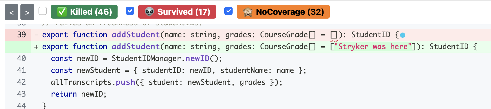

# Transcript Server (Test Adequacy Activity)
The objective of this activity is to build experience improving test suites using two different adequacy criteria: line coverage and mutation coverage. The instructions in this activity handout reference line numbers in transcriptManager.ts - so please do *not* change the contents of this file while you are following along with the instructions, or else you may find that the line numbers referenced here do not match what you see.

## First steps:
After installing the dependencies (`npm install`), `npm test` will execute the test suite. You should get output that looks like this:

```
$ npm test

> transcript-server-openapi@1.0.0 test
> jest --coverage

 PASS  src/transcriptManager.spec.ts
  TranscriptManager
    Create student
      ✓ should return an ID, starting with 1 (2 ms)
    Adding grades
      ✓ should add the grade to the transcript (1 ms)
      ✓ Should throw an error if the student ID is invalid (12 ms)
    getStudentIDs
      ✓ Should return only the students who match the name (1 ms)
    Deleting students
      ✓ Should result in the students' transcript no longer being available (1 ms)
      ✓ Should throw an error if the ID is invalid (1 ms)
    getAll
      ✓ Should return the transcripts

----------------------|---------|----------|---------|---------|-------------------
File                  | % Stmts | % Branch | % Funcs | % Lines | Uncovered Line #s 
----------------------|---------|----------|---------|---------|-------------------
All files             |   83.01 |       60 |   84.21 |   84.78 |                   
 transcriptManager.ts |   83.01 |       60 |   84.21 |   84.78 | 18-21,76,85,95    
----------------------|---------|----------|---------|---------|-------------------
Test Suites: 1 passed, 1 total
Tests:       7 passed, 7 total
Snapshots:   0 total
Time:        0.971 s, estimated 1 s
Ran all test suites.
```

This output shows the tests that ran, the percentage of statements/branches/functions/lined covered, and the line numbers that are not covered.

Examine the tests in the file `transcriptManager.spec.ts`, and the implementation in `transcriptManager.ts`. 

## line Coverage
The first objective of this activity is to examine the lines that are not covered in `transcriptManger.ts` and enhance the tests so that they are covered. The output that you get from `npm test` shows that the uncovered lines are 18-21,76,85,95.

For our purposes, we won't care about lines 18-21 (that allow this transcript server to implement the canonical demo set, and are not actually part of the specification that we should test).

Hence, your objective will be to improve the tests so that lines 76, 85, and 95 are covered.

As you implement these tests, think about how the tests that you are writing (and those that are there) reflect the principles of "good tests" that we discussed in class today.

As an example - there is one "TODO" that points out what is likely a particularly bad assumption of one of the starter tests: this test assumes that the order of transcripts returned by `getStudentIDs` is always in the order that the students were added. Do you think that this is a reasonable assumption? Is it worth the effort to change the test, or would you leave it as it is?

## Mutation Coverage
As you were implementing your tests with the line coverage targets in mind, you may have noticed that there were a variety of tests that you could write which would have covered those lines - and that some of those might have been stronger tests than others.

Mutation coverage helps us spot weaknesses in our tests. To run Stryker and collect mutation coverage, run the command `npm run stryker`. This will take somewhat longer than running the tests normally, but should take no longer than a minute. After it runs, you should see quite a bit of output printed out, ending with something like this:

```

[Survived] ArrayDeclaration
src/transcriptManager.ts:11:36
-   let allTranscripts: Transcript[] = [];
+   let allTranscripts: Transcript[] = ["Stryker was here"];
Ran all tests for this mutant.

[Survived] ConditionalExpression
src/transcriptManager.ts:94:7
-     if (theGrade === undefined) {
+     if (false) {
Tests ran:
    TranscriptManager Adding grades should add the grade to the transcript


Ran 1.17 tests per mutant on average.
----------------------|---------|----------|-----------|------------|----------|---------|
File                  | % score | # killed | # timeout | # survived | # no cov | # error |
----------------------|---------|----------|-----------|------------|----------|---------|
All files             |   48.42 |       46 |         0 |         17 |       32 |       0 |
 transcriptManager.ts |   48.42 |       46 |         0 |         17 |       32 |       0 |
----------------------|---------|----------|-----------|------------|----------|---------|
21:33:14 (41688) INFO DashboardReporter The report was not send to the dashboard. The dashboard.project and/or dashboard.version values were missing and not detected to be running on a build server.
21:33:14 (41688) INFO HtmlReporter Your report can be found at: file:///Users/Avery/Documents/NEU/CS4530/test-adequacy-activity/reports/mutation/mutation.html
21:33:14 (41688) INFO MutationTestExecutor Done in 11 seconds.
```

Open the HTML report in your web browser - copy/paste the `file://` URL into a browswer tab. Click on the `transcriptManager.ts` file in the report to see the report. Examine the mutants that are not detected (again, ignoring lines 18-22). The first "survived" (not detected) mutant should be on line 39. Clicking on the red dot will reveal the mutation:


This report shows that Stryker changed line 39 to default the student's starting transcript to be an array with the single element `"Stryker was here"`. This mutation was not detected by the test suite: there is no test that will fail if the student transcript were initialized to be anything besides an empty array!

To enhance the test suite to detect this mutant, add a test that adds a new student to the `db`, and then expects that the student's transcript is empty.

After you add the new test, run `npm run stryker` again to get an updated mutation report, and reload it in your browser. You should now see that the mutation on the line is "killed" (show the "killed" mutants by clicking "killed" in the filter bar at the top).

Examine the remaining mutants that are not detected, and consider writing tests that will detect them. For each one, think about how the mutated program behavior would differ - and how you could detect that difference. Remember that some mutations might be "equivalent" - that they do not cause any detectable behavioral difference. 

Some mutants might cause an observable difference in behavior, but if they are outside of a reasonable specification, they may not matter. For example, do you think that we should write tests that expect that each error message has some particular format?